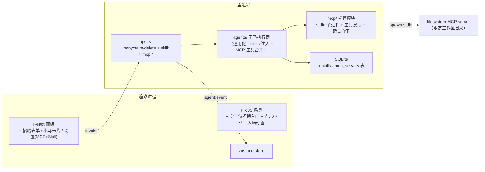

# 小马办公室 M3 接口标准与实施规范（扩展：招聘 / Skill / MCP / 文件马）

> 本文档是交给开发者（人或 AI）的实施任务书。产品背景见 [../prd.md](../prd.md)，M1/M2 任务书见 [接口与实施规范.md](./接口与实施规范.md)。
> **里程碑映射说明**：PRD 的「M3 演出」（动画全套 / 任务日志 / 失败重试）已在 M1/M2 中提前完成并验收；本阶段 M3 对应 PRD 的「M4 扩展」。
> **接口的唯一事实源仍是 `src/shared/types.ts` 与 `src/shared/ipc.ts`**；本文第 2~3 节为对这两个文件的增量修改，实施时先改接口文件再改实现。

## 0. 阶段定位与现状（开发前必读）

### 0.1 已完成（M1 + M2，已人工验收，不要破坏）

| 已完成 | 位置 |
|---|---|
| 场景与全套动画（行走/气泡/working/道歉/钉白板） | `src/renderer/src/scene/` |
| 领队马 streamText 派单循环 + 子马执行器 | `src/main/agents/index.ts` |
| sql_query 守卫与重试、render_report、PDF 导出 | `src/main/agents/`、`src/main/reports.ts` |
| xlsx → SQLite、对话/报告/run 持久化 | `src/main/db/`（**实际用 `node:sqlite` DatabaseSync，非 better-sqlite3**） |
| AgentEvent 事件流 + 任务日志 + ChatDock | `src/renderer/src/ui/`、`store/appStore.ts` |

### 0.2 本阶段范围

1. **MCP 基础设施**：主进程托管 stdio MCP server 子进程，自动发现工具并合并进小马工具集；全局 MCP server 配置 CRUD + 连接测试。
2. **文件马上岗**：绑定官方 filesystem MCP（限定工作区目录）+ 内置 `export_report_file` 工具，实现「报告归档」用户故事；删除/覆盖类操作前弹原生确认框。
3. **Skill 体系**：skills 表 + 预置 Skill 种子 + 应用内 markdown 编辑器；勾选后注入小马 system prompt。
4. **小马管理**：点击小马查看/编辑（换肤、勾 Skill、绑 MCP）；点击空工位「招聘」自定义小马（入场动画、立即可接单、可解雇）。

### 0.3 明确不做（留给 M4 打磨阶段）

- ❌ 音效、光影打磨、演示数据调优与彩排
- ❌ HTTP/SSE 形态的 MCP transport（只做 stdio 本地子进程）
- ❌ MCP resources / prompts 能力（只取 tools）
- ❌ 多于 1 只自定义小马（办公室上限 6 工位 = 5 预置 + 1 自定义）

### 0.4 新增依赖

```bash
npm i @ai-sdk/mcp @modelcontextprotocol/server-filesystem
# 若 @ai-sdk/mcp 的 peer 依赖要求，则一并安装 @modelcontextprotocol/sdk
```

`@modelcontextprotocol/server-filesystem` 装为**本地依赖**而非 npx 临时拉取，保证离线演示可用（见坑位 2）。

## 1. 架构增量



硬性边界（沿用 M1/M2，新增两条）：

1. MCP 子进程只由主进程 spawn 与托管，渲染进程不可见。
2. 招聘/编辑/配置走 invoke 请求-响应（不是任务进度，不进 AgentEvent 流）；**运行中（一轮 run 内）的 MCP 工具调用必须照常发 `tool_call_started/finished` 事件**，动画与日志不能缺失。

## 2. 共享数据模型增量（src/shared/types.ts）

```ts
/** 配件槽（M1 的 PonyActor 已支持这 4 种绘制） */
export type AccessoryId = 'glasses' | 'bowtie' | 'beret' | 'brass-tag'

/** 一个 Skill = 一份 markdown，勾选后注入小马 system prompt */
export interface Skill {
  id: string
  name: string          // 如「邮件草稿规范」
  description: string   // 一句话用途，列表展示
  markdown: string      // 注入正文（职责描述 + 工作方法 + 输出格式要求）
  builtin: boolean      // 预置 skill 可编辑、不可删除
  updatedAt: number
}

/** 全局 MCP server 配置（stdio 子进程） */
export interface McpServerConfig {
  id: string
  name: string                  // 如「filesystem」
  command: string               // 可执行命令
  args: string[]
  env: Record<string, string>
  builtin: boolean              // 预置 filesystem 不可删除（可编辑 args 以外字段需谨慎）
}

/** 设置页展示用的运行状态 */
export interface McpServerStatus {
  id: string
  state: 'stopped' | 'starting' | 'running' | 'error'
  tools: string[]               // 已发现的工具名
  error?: string
}

/** 招聘/编辑小马的提交体（pony:save 入参） */
export interface PonyDraft {
  id?: string                   // 不传 = 新建（主进程生成 custom-<uuid8>）；传 = 编辑
  name: string
  role: string
  skin: PonySkin
  skills: string[]              // Skill id 列表
  mcpServers: string[]          // McpServerConfig id 列表
}
```

既有类型变化：

- `Pony.skills` / `Pony.mcpServers`：**字段已存在，本阶段启用**（不再恒为空）。
- `PonySkin.accessories` 类型收紧为 `AccessoryId[]`。
- `AgentEvent` **协议不变**。MCP 工具调用复用 `tool_call_started/finished`，`tool` 字段格式约定为 `<serverName>.<toolName>`（如 `filesystem.write_file`）；内置工具仍用裸名（`sql_query` / `render_report` / `export_report_file`）。

## 3. IPC 契约增量（src/shared/ipc.ts）

| channel | 方向 | 签名 | 说明 |
|---|---|---|---|
| `pony:save` | invoke | `(draft: PonyDraft) => Pony` | 新建或编辑；校验失败抛错（见 3.1） |
| `pony:delete` | invoke | `(id: string) => void` | 仅允许删自定义马；预置马抛错 |
| `skill:list` | invoke | `() => Skill[]` | builtin 在前，按 updatedAt 排序 |
| `skill:save` | invoke | `(s: { id?: string; name: string; description: string; markdown: string }) => Skill` | 新建/编辑；builtin skill 允许编辑内容 |
| `skill:delete` | invoke | `(id: string) => void` | builtin 抛错；被小马引用时一并从其 skills 中移除 |
| `mcp:list` | invoke | `() => McpServerConfig[]` | |
| `mcp:save` | invoke | `(c: { id?: string; name: string; command: string; args: string[]; env: Record<string,string> }) => McpServerConfig` | 保存后使该 server 的连接缓存失效 |
| `mcp:delete` | invoke | `(id: string) => void` | builtin 抛错；被小马引用时一并解绑 |
| `mcp:test` | invoke | `(id: string) => McpServerStatus` | 启动（或复用）连接并返回工具列表；失败返回 state='error' 不抛错 |
| `mcp:status` | invoke | `() => McpServerStatus[]` | 全部 server 当前状态（不主动拉起连接） |

`WindowApi` 对应新增方法名：`savePony / deletePony / listSkills / saveSkill / deleteSkill / listMcpServers / saveMcpServer / deleteMcpServer / testMcpServer / mcpStatus`。**preload 的 `index.ts` 与 `index.d.ts` 必须同步更新**。

### 3.1 pony:save 校验规则（主进程执行，全部满足才放行）

1. `name` 1~12 字符、`role` 1~60 字符，去首尾空白后非空；
2. `skin.palette` ∈ 5 套预设，`skin.accessories` ⊆ 4 种配件且去重；
3. `skills` / `mcpServers` 中的 id 必须存在（不存在的静默剔除即可）；
4. 新建时：当前小马总数 < 6，否则抛「办公室没有空工位了」；
5. 编辑预置马（builtin=true）：只接受 `skin` / `skills` / `mcpServers` 三个字段的变更，`name` / `role` 改动忽略；
6. `id` 不存在时抛错；不可通过 save 改 `builtin` 标志。

## 4. MCP 托管规范（src/main/mcp/index.ts，新模块）

### 4.1 客户端与生命周期

- 用 **AI SDK v6 的 `@ai-sdk/mcp` 包**（注意：不是 v5 时代 `ai` 包里的 `experimental_createMCPClient`，见坑位 1）：

```ts
import { createMCPClient } from '@ai-sdk/mcp'
import { StdioMCPTransport } from '@ai-sdk/mcp/mcp-stdio'

const client = await createMCPClient({
  transport: new StdioMCPTransport({ command, args, env })
})
const tools = await client.tools()   // 直接得到 AI SDK ToolSet
```

- **懒连接 + 缓存**：模块内维护 `Map<serverId, client>`；首次被某只小马用到时连接（连接超时 10s），成功后复用。
- **失效时机**：`mcp:save` / `mcp:delete` 该 server 后 close 并清缓存；子进程意外退出时清缓存（下次用到时重连）。
- **退出清理**：`app.on('before-quit')` 中 close 全部 client，避免僵尸子进程。
- 连接失败的处理：`getToolsFor` 直接抛错 → 子马执行器 catch → 发 `task_failed`（reason 形如「MCP server "filesystem" 启动失败：…」），领队马如实转告。**不做静默降级**。

### 4.2 对外 API（供子马执行器调用）

```ts
/** 取多个 server 的工具合集，已包装事件发射与确认守卫 */
getMcpToolsFor(serverIds: string[], ctx: { runId: string; taskId: string; pony: PonyId; emit: Emitter }): Promise<ToolSet>
/** 设置页用 */
testServer(id: string): Promise<McpServerStatus>
listStatus(): McpServerStatus[]
closeAll(): Promise<void>
```

### 4.3 工具包装（每个 MCP 工具必须包两层）

对 `client.tools()` 返回的每个工具，包装其 `execute`：

1. **事件层**：执行前发 `tool_call_started`（`tool` = `<serverName>.<toolName>`，`argsSummary` = JSON 截断 ≤200 字符）；执行后发 `tool_call_finished`（ok / resultSummary / durationMs）。`pony` 字段用 ctx 传入的真实小马 id，**不得写死**。
2. **确认守卫层**：工具名匹配 `/^(write|edit|move|delete|remove)_/` 时，先 `dialog.showMessageBox(win)`（type='warning'，buttons=['执行', '取消']，message 含工具名与目标路径）。用户取消时**不抛错**，向模型返回字符串 `用户取消了本次「<工具名>」操作，请如实汇报，不要重试。`，并发 `tool_call_finished(ok=false, resultSummary='用户取消')`。

工具名冲突（多 server 同名工具）：统一加前缀 `<serverName>_` 后再合并。

### 4.4 预置 server 与工作区目录

- 工作区目录：`join(app.getPath('documents'), 'PonyOffice工作区')`，主进程启动时 `mkdirSync(recursive)` 确保存在；可被 `.env` 的 `WORKSPACE_DIR` 覆盖。
- 预置 filesystem server 种子（builtin=true，启动方式见坑位 2）：

```ts
{
  id: 'filesystem', name: 'filesystem', builtin: true,
  command: process.execPath,
  args: [require.resolve('@modelcontextprotocol/server-filesystem/dist/index.js'), WORKSPACE_DIR],
  env: { ELECTRON_RUN_AS_NODE: '1' }
}
```

## 5. 文件马规范

### 5.1 能力 = filesystem MCP + 1 个内置工具

- 数据迁移：启动时若 file 马的 `mcpServers` 为空，自动绑定 `['filesystem']` 并把 role 更新为「文件管理员：归档报告、整理办公室工作区内的文件」（幂等，见坑位 6）。
- 解除派单封锁：`runPonyTask` 中删除 `to === 'file'` 的拒绝分支（只保留 leader 与不存在 id 的拒绝）；`prompts.ts` 领队马守则同步改写（删除「file 能力暂未开通」，新增「归档/整理文件派给 file」）。

### 5.2 内置工具 export_report_file（解决巨型 HTML 不进上下文）

```ts
export_report_file({ reportId: string, filename?: string })
  => { savedPath: string } | { error: string }
```

- 主进程从 reports 表读完整 HTML（含内联 ECharts，体积 ~1MB），**直接写入工作区目录**，只把保存路径回喂模型——报告内容绝不进入 LLM 上下文（坑位 3）。
- `filename` 缺省为 `<title>.html`，清洗 Windows 非法字符 `\ / : * ? " < > |`；目标已存在时走 4.3 的确认守卫（同样弹覆盖确认框）。
- 照常发 `tool_call_started/finished` 事件（tool='export_report_file'，pony='file'）。

### 5.3 文件马 system prompt 要点（加入 prompts.ts）

- 注入：工作区根路径 + 最新 ≤5 份报告清单（id / title / 生成时间）。
- 守则：归档报告必须用 `export_report_file`（不要试图用 write_file 抄写报告内容）；其余文件操作用 filesystem 工具；只能在工作区内操作；操作被用户取消时如实汇报。

### 5.4 领队马 prompt 增量

- 注入最新 ≤5 份报告清单（id/title），使「把刚才的报告归档」可直接派单（brief 中带 reportId）。
- 花名册本就来自 `listPonies()` 动态生成，自定义马自动入册；`dispatch` 工具的 description/inputSchema 描述改为按花名册动态拼接，不再写死 `data | report | writer`。

## 6. Skill 体系规范

### 6.1 注入规则（子马执行器统一实现）

system prompt 拼接顺序：`基础角色 prompt`（leader/data/report/writer 沿用现有函数；file 用 5.3；自定义马用 genericSystem）+ 每个勾选 Skill 追加一段：

```
## 技能：<name>
<markdown 原文>
```

- 领队马同样支持勾选 Skill（追加在守则之后）。
- Skill 数量不限制，但编辑器提示单份 ≤2000 字符（不强制截断）。

### 6.2 预置 Skill 种子（builtin=true，INSERT OR IGNORE）

| id | name | 要点（markdown 内容由实施者撰写，≤300 字） |
|---|---|---|
| skill-email | 邮件草稿规范 | 主题/称呼/正文三段式/落款；商务礼貌用语 |
| skill-summary | 工作总结结构 | 背景→数据要点→结论→下一步；用要点列表 |
| skill-archive | 归档命名规范 | 文件名 `YYYY-MM-DD_主题`；先建月份子文件夹再归档 |

## 7. SQLite 增量（src/main/db/index.ts）

```sql
CREATE TABLE IF NOT EXISTS skills      (id TEXT PRIMARY KEY, json TEXT NOT NULL);
CREATE TABLE IF NOT EXISTS mcp_servers (id TEXT PRIMARY KEY, json TEXT NOT NULL);
```

- 种子：3 份预置 Skill（6.2）+ 1 个 filesystem server（4.4），`INSERT OR IGNORE`。
- 新增 CRUD 函数：`listSkills/saveSkill/deleteSkill`、`listMcpServers/saveMcpServer/deleteMcpServer`、`savePony/deletePony`。
- `listPonies()` 排序规则更新：预置 5 只按固定顺序，自定义马排最后。
- **file 马迁移注意**：ponies 表种子是 `INSERT OR IGNORE`，老库中 file 马的旧 role/空 mcpServers 不会被种子覆盖，必须在 `initDb()` 里写显式的幂等迁移（读出→判断→UPDATE）。

## 8. UI 与场景规范（渲染进程）

### 8.1 新增面板（沿用现有视觉体系：亚麻纹理、黄铜描边、衬线标题）

| 面板 | 入口 | 内容 |
|---|---|---|
| 小马卡片 | 点击场景中任意小马 | 名字/职能/工位状态；皮肤编辑（调色板 5 选 1 预览 + 配件多选）；Skill 勾选；MCP 勾选；自定义马显示「解雇」按钮（需确认）。保存调 `savePony` |
| 招聘表单 | 点击空工位（虚线占位 + 「招聘」木牌） | 步骤：起名+职能 → 选皮肤（实时预览色块）→ 勾 Skill → 勾 MCP → 保存。保存调 `savePony` |
| 设置面板 | 标题栏齿轮按钮 | Tab1 MCP servers：列表（含状态点）/ 新建编辑表单（name/command/args 逐行/env 键值对）/「测试连接」按钮展示工具列表 / 删除；Tab2 Skill 库：列表 + markdown 编辑器（textarea 即可，等宽字体）+ 删除 |

交互约束：任务运行中（store.running）禁用 savePony/deletePony 入口（按钮置灰 + 提示「小马们正在干活」）；表单 Enter 提交同样排除输入法组合态。

### 8.2 场景增量（scene/）

1. **点击小马**：`PonyActor.eventMode='static'`、`cursor='pointer'`，pointertap 通过 sceneBus 通知 React 打开小马卡片。
2. **空工位**：第 6 工位无马时绘制虚线轮廓 + 「招聘」小木牌（eventMode='static'），点击打开招聘表单；有马后隐藏。
3. **入场动画**：`savePony` 新建成功后，渲染进程把新马 actor 创建在场景右侧画外（x = 1680 + 80），行走（160px/s）到第 6 工位，到位后气泡「大家好，我是〈name〉！」（2s）。解雇反向：气泡「再见！」→ 走出画外 → 移除 actor。
4. **换肤即时生效**：`PonyActor` 增加 `applySkin(skin)` 方法重建 Graphics（保持位置与动画状态）；store 的 ponies 更新后由 SceneCanvas 对比驱动。
5. store 增量：`ponies` 的增删改同步、`openPonyId` / `hiringOpen` / `settingsOpen` 等 UI 状态、`skills` / `mcpServers` 列表缓存。

## 9. 实施顺序与验收标准

实施顺序（每步保持 `npm run typecheck` 通过）：

1. 接口层：`types.ts` / `ipc.ts` / preload `index.ts` + `index.d.ts` 增量
2. DB 增量：skills / mcp_servers 表 + 种子 + file 马幂等迁移 + CRUD 函数
3. IPC handlers：pony / skill / mcp 全部 channel + store 对接
4. MCP 托管模块：连接缓存 + 工具发现 + 事件包装 + 确认守卫 + `mcp:test`
5. 文件马：filesystem 绑定 + `export_report_file` + prompts 更新（领队马解禁 file、注入报告清单）
6. 子马执行器通用化：skills 注入 + MCP 工具合并 + dispatch 校验更新
7. UI：设置面板（MCP/Skill）→ 小马卡片 → 招聘表单
8. 场景：点击小马 / 空工位 / 入场与解雇动画 / 换肤重绘
9. 端到端联调验收

### M3 验收标准

- [ ] **招聘端到端**：点击空工位 → 填表（名字/职能/皮肤/Skill/MCP）→ 保存 → 入场动画走到第 6 工位 → 对领队马提一个该马职能内的问题，领队马成功派单给它并完成
- [ ] **归档端到端**：先跑通 M2 报告链路，再说「把刚才的报告归档到工作区」→ 领队马派单文件马 → `export_report_file` 写出 HTML → 工作区目录里能双击打开且图表正常（离线）
- [ ] **确认框**：让文件马覆盖/移动/删除文件时弹出原生确认框；点「取消」后小马如实汇报「操作被取消」，应用不崩、run 正常结束
- [ ] **MCP 设置页**：新建一个无效 server（如 command 写错）→ 测试连接显示明确错误不崩溃；filesystem server 测试连接能列出工具清单
- [ ] **Skill 生效**：给文书马勾选「邮件草稿规范」，让它写邮件，输出明显遵循 skill 中的格式要求；取消勾选后行为恢复
- [ ] **换肤即时生效**：给预置马换调色板/配件，场景立刻重绘，重启后保持
- [ ] **越权防护**：在 brief 中诱导文件马读工作区外路径（如 C:\Windows），filesystem server 拒绝且小马如实汇报
- [ ] **守卫**：已有 6 只马时招聘入口隐藏、`pony:save` 新建抛错；预置马不可删；leader 不可被派单（回归）
- [ ] **持久化**：重启后自定义马（含皮肤/Skill/MCP 绑定）、自定义 Skill、MCP 配置全部恢复
- [ ] **回归**：M2 验收清单全部重测通过（核心报告链路、失败道歉、SQL 守卫、PDF、重启恢复）；`npm run typecheck` 通过
- [ ] **退出清理**：关闭应用后任务管理器中无残留 MCP 子进程

## 10. 已知坑位（务必避开）

1. **AI SDK v6 的 MCP 包**：本项目 `ai` 是 v6，MCP 客户端在独立包 `@ai-sdk/mcp`（`createMCPClient` + `@ai-sdk/mcp/mcp-stdio` 的 `StdioMCPTransport`）；不要照旧文档从 `ai` 包导 `experimental_createMCPClient`（v6 已移除）。
2. **Windows 下不要 spawn npx**：`npx` 不是可执行文件（spawn ENOENT），且首次运行要联网拉包，演示现场断网即挂。正确做法：filesystem server 装为本地依赖，用 `process.execPath` + `env: { ELECTRON_RUN_AS_NODE: '1' }` 把 Electron 当 Node 跑其入口 js（见 4.4）。
3. **报告 HTML 禁止进入模型上下文**：reports 表的 html 含内联 ECharts（约 1MB），归档必须走主进程直写的 `export_report_file`，绝不能让文件马「读报告内容再 write_file」。
4. **事件不能缺**：MCP 工具与 `export_report_file` 都必须发 `tool_call_started/finished`，且 `pony` 字段动态取自当前小马 id（现有代码里 sql_query 写死 'data' 的模式不可照抄到通用执行器）。
5. **ponies 种子不会自我更新**：`INSERT OR IGNORE` 对老库无效，file 马的绑定与 role 更新必须写显式幂等迁移。
6. **MCP 子进程僵尸**：before-quit 必须 closeAll；`mcp:save` 后必须使连接缓存失效，否则改完配置测试的还是旧进程。
7. **确认框计时**：用户在确认框上的停留时间会计入 `durationMs` 与 LLM 等待，属预期行为；但要确保 dialog 挂在主窗口上（模态），避免被场景遮挡找不到。
8. **preload 三处同步**：`shared/ipc.ts`、`preload/index.ts`、`preload/index.d.ts` 三处必须同步增量，漏一处 typecheck 或运行时才会暴露。
9. **工具名冲突**：多 server 合并工具集前先按 `<serverName>_` 前缀消歧，否则后者覆盖前者。
10. **解雇/换肤时机**：运行中（running=true）禁止 savePony/deletePony，避免 run 进行到一半小马消失导致事件找不到 actor。
