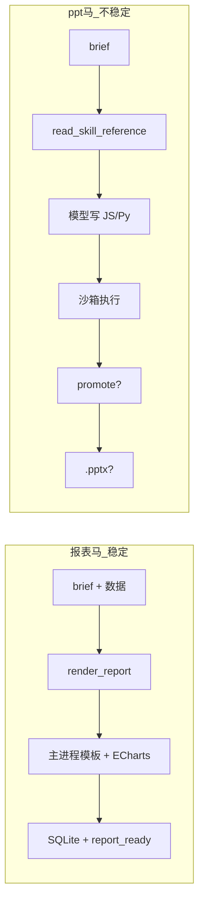
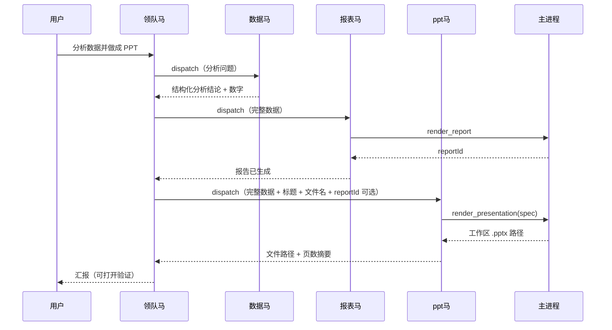

# PPT 生成流程优化计划书

| 项 | 内容 |
|---|---|
| 文档版本 | v1.0 |
| 日期 | 2026-06-12 |
| 状态 | 待实施 |
| 关联 | `prd.md`、`AGENTS.md`、`docs/演示剧本.md` |
| 目标场景 | 电信培训演示：数据分析闭环后，稳定产出真实 `.pptx` 文件 |

---

## 1. 背景

### 1.1 业务诉求

当前核心演示链路为：

```
xlsx 上传 → SQLite 入库 → 数据马 text-to-SQL → 报表马 HTML 报告 → 文件马归档
```

培训场景中，用户常追加需求：**「把分析结果做成 PPT」**。为此已招聘自定义「ppt马」，绑定 `pptx` Skill、`filesystem` MCP，并启用沙箱与 Skill script 权限。

### 1.2 已做工作（基线）

| 能力 | 状态 | 说明 |
|------|------|------|
| Skill 渐进式加载 | ✅ | `read_skill_reference` 按需读 `pptxgenjs.md` 等 |
| 任务沙箱 | ✅ | `.pony-sandbox/<runId>/<taskId>/{scripts,work,out}` |
| 沙箱工具 | ✅ | `run_sandbox_script`、`promote_sandbox_file` |
| 沙箱内免审批 | ✅ | `autoAllow` 跳过 120s 审批 |
| 沙箱启用条件 | ✅ | 仅 `pony.skills.length > 0 && canRunSkillScript` |
| 专用 presentation prompt | ❌ 已撤回 | ppt马走 `genericSystem` + Skill 注入 |

### 1.3 仍存在的失败模式（日志实证）

1. 模型误用 `clean.py`、`thumbnail.py` 等**编辑类** Skill 脚本，而非生成路线。
2. 走 Node + `pptxgenjs` 时沙箱脚本 `Cannot find module 'pptxgenjs'`。
3. 写完沙箱脚本未执行，或执行成功但未调用 `promote_sandbox_file`。
4. `run_sandbox_script` 返回 `ok=false`，子任务仍发 `task_completed`，领队马误报「PPT 已生成」。
5. 子马 `stepCountIs(6)` 步数不足，长工具链被截断。

---

## 2. 目标与非目标

### 2.1 目标

1. **演示可重复**：电信标准剧本下，用户说「做成 PPT」，工作区出现可打开的 `.pptx`（非空、非损坏）。
2. **架构一致**：与报表马 `render_report` 同级，有主进程可信产出层；Skill 提供领域知识，不依赖模型写可执行代码。
3. **Skill 无关**：不为每个网上下载的 Skill 改 `SKILL.md` 或硬编码流程；平台能力通用可复用。
4. **失败透明**：工具失败 → 子任务失败 → 领队马如实汇报，禁止假完成。
5. **可渐进交付**：P0 补丁可独立上线；P1 主路径可与 P0 并行设计、分 PR 合并。

### 2.2 非目标（明确不做）

- ❌ 修改 `skills/pptx/` 等第三方 Skill 内容或为其单独写入口脚本。
- ❌ 按文件扩展名（如 brief 含 `.pptx`）做硬编码交付校验。
- ❌ 为 ppt马单独维护 `presentationSystem`（仍用 `genericSystem` + Skill）。
- ❌ 远程 CDN、LibreOffice 在线转换、假 PPT 兜底文件。
- ❌ 首版支持复杂动画、母版深度定制、演讲者备注批量编辑。

---

## 3. 问题诊断

### 3.1 架构层：产出路径不对称



报表马：**结构化输入 → 确定性主进程工具**。  
ppt马：**非结构化 brief → LLM _codegen → 多步工具链 → 环境依赖**。  
成功率差距主要来自架构，而非单一 bug。

### 3.2 Skill 层：脚本目录语义与任务不匹配

`skills/pptx/scripts/` 以 **编辑已有 pptx** 为主（unpack / pack / clean / thumbnail / add_slide）。  
「从零创建」在 `SKILL.md` 中指向 `pptxgenjs.md`，属于**文档驱动写代码**，无「一键生成」脚本。

`run_skill_script` 工具描述会列出全部可执行脚本（含 `office/*`），易误导模型把编辑工具当生成器。

### 3.3 运行时层：依赖与路径

| 路线 | 依赖 | 当前问题 |
|------|------|----------|
| Node / pptxgenjs | `pptxgenjs` npm 包 | 未列入 `package.json`；沙箱 cwd 下 `require` 找不到 `node_modules` |
| Python / python-pptx | 用户本机 pip | 用户环境可成功（曾手动 `python create_ppt.py`），但模型常选 Node |

### 3.4 编排层：步数、成败语义、领队 brief

| 问题 | 位置 | 影响 |
|------|------|------|
| 子马最多 6 步 | `agents/index.ts` `stepCountIs(6)` | read + write + run + promote + verify 易截断 |
| 工具失败仍 task_completed | `runPonyTask` | 领队马幻觉成功 |
| 领队对自定义文件马 brief 无硬性数据要求 | `prompts.ts` `leaderSystem` | ppt马拿到的数据不完整 |
| promote 从未成功调用 | 历史日志 | 成品留在沙箱或被清理 |

---

## 4. 设计原则

1. **主进程是唯一可信执行边界**（与 `AGENTS.md` 一致）：`.pptx` 字节应由主进程或主进程 spawn 的受控子进程写出。
2. **Skill 是知识，不是编译器**：参考 agentskills.io 渐进式披露；执行归平台工具。
3. **与报表马对齐**：`render_report` / `render_presentation` 对称设计，降低维护成本。
4. **通用治理**：成败判定基于「本轮关键工具是否失败」，不按扩展名特化。
5. **沙箱保留为高级路径**：绑定 Skill 且需自定义脚本时仍可用；演示主路径不依赖沙箱 codegen。

---

## 5. 目标架构

### 5.1 端到端流程（目标态）



### 5.2 双路径策略

| 路径 | 适用 | 优先级 |
|------|------|--------|
| **A. 主路径** `render_presentation` | 演示、电信剧本、标准幻灯片 | P1 |
| **B. 高级路径** 沙箱脚本 + Skill 参考 | 用户自定义 Skill、特殊格式、实验 | 保留，P0 修补 |

演示彩排走 **路径 A**；路径 B 不阻塞 A 上线。

### 5.3 模块边界

```
src/main/
  presentations/          # 新增
    index.ts              # renderPresentation(spec) → 文件路径
    schema.ts             # Zod SlideSpec 校验
    renderPptxPython.ts   # python-pptx 实现（优先）
    renderPptxNode.ts     # pptxgenjs 备选
  agents/
    index.ts              # 注册 render_presentation 工具
    prompts.ts            # leader 派单规则、子马步数
  skills/
    scriptTools.ts        # 脚本目录说明优化
  sandbox.ts              # 已有，维持
```

---

## 6. 分阶段实施计划

### Phase 0：编排与环境修补（预估 0.5～1 天）

**目标**：不新增主工具，降低现有沙箱路径失败率，修复「假完成」。

| # | 任务 | 文件 | 说明 |
|---|------|------|------|
| P0-1 | 子马步数上调 | `agents/index.ts` | Skill 绑定马 `stepCountIs(6)` → `stepCountIs(10)`；可按 `pony.skills.length > 0` 区分 |
| P0-2 | NODE_PATH 注入 | `skills/runScript.ts` | 执行 `.js` 时 `NODE_PATH=<workspace>/node_modules` |
| P0-3 | 安装 pptxgenjs | `package.json` | `npm install pptxgenjs`，演示机一次配置 |
| P0-4 | 子任务成败语义 | `agents/index.ts` | `generateText` 后扫描本轮 `tool_call_finished`；若 `run_sandbox_script` / `run_skill_script` / `promote_sandbox_file` 等关键工具 `ok=false`，发 `task_failed` 而非 `task_completed` |
| P0-5 | 领队派单规则 | `prompts.ts` | 派给绑定 Skill 且需产出文件的马：brief 须含完整数据、输出文件名、格式；参考报表马对 data 的完整性要求 |
| P0-6 | 脚本工具描述 | `skills/scriptTools.ts` | 通用说明：`scripts/` 多为编辑辅助；从零产出先 `read_skill_reference` 再沙箱自写脚本；目录列表默认不展示 `scripts/office/**`（平台启发式，不改 Skill） |
| P0-7 | 沙箱 prompt 强化 | `sandbox.ts` | 明确顺序：write → run_sandbox_script → out/ → promote_sandbox_file → get_file_info |

**P0 验收**：

- [ ] 沙箱路径：模型走完 promote 后工作区有文件（或明确 `task_failed` + stderr）。
- [ ] 脚本失败时子任务为 `task_failed`，领队马不说「已生成」。
- [ ] `npm run typecheck` 通过。

---

### Phase 1：主进程 `render_presentation`（预估 1～1.5 天）

**目标**：演示主路径与 `render_report` 对称，电信剧本稳定出 PPT。

#### P1-1 数据契约 `PresentationSpec`

在 `src/shared/types.ts`（或 `src/main/presentations/schema.ts`）定义：

```typescript
/** 单页幻灯片 */
interface SlideSpec {
  layout: 'title' | 'section' | 'bullets' | 'two_column' | 'kpi_row'
  title?: string
  subtitle?: string
  bullets?: string[]
  left?: { title?: string; bullets?: string[] }
  right?: { title?: string; bullets?: string[] }
  kpis?: { label: string; value: string; hint?: string }[]
}

interface PresentationSpec {
  title: string
  author?: string
  filename: string          // 相对工作区，如「2025年下半年营业厅经营分析.pptx」
  theme?: 'warm' | 'midnight' | 'sage'  // 映射 pptx Skill 调色板灵感，非 Skill 硬依赖
  slides: SlideSpec[]
}
```

Zod 校验：页数 1～30、`filename` 安全化、禁止 `..`。

#### P1-2 主进程渲染器

优先级：

1. **Python `python-pptx`**（与用户已成功环境一致）
   - 主进程 `spawn` 内联脚本或 `src/main/presentations/templates/render.py`
   - stdin 传入 JSON spec，stdout 返回 `{ path, slideCount, sizeBytes }`
2. **Node `pptxgenjs`**（备选，`python-pptx` 不可用时）

输出路径：`resolveWorkspaceTarget(sanitizeFilename(spec.filename))`，直接写工作区，**不经沙箱**。

#### P1-3 Agent 工具 `render_presentation`

```typescript
// 仅对绑定了「产出类」Skill 的小马注入——启发式：
// pony.skills 非空 && (canExportReports || canRunSkillScript)
// 或配置项 pony.capabilities.includes('presentation')
```

工具行为：

- 入参：`PresentationSpec`（JSON）
- 治理：`requiresWrite: true`，`riskLevel: medium`，可配置 `autoAllow` 或走快速审批（演示模式）
- 事件：`tool_call_started/finished`，成功时 `presentation_ready`（新 AgentEvent，可选，与 `report_ready` 对称）
- 返回：`{ path, slideCount, sizeBytes }`

#### P1-4 Prompt 调整（通用，非 ppt 专用 system）

在 `genericSystem` 或 `SKILL_PROGRESSIVE_NOTE` 增加一句：

> 若已提供 `render_presentation` 工具，优先用它产出 `.pptx`；沙箱脚本仅在该工具不可用或 Skill 明确要求特殊流程时使用。

`leaderSystem` 增加：

> 需要 PPT 时，派给绑定 pptx 等 Skill 的马，brief 须附：报告标题、完整分析数据（同报表马）、期望文件名；若已有 HTML 报告可附 `reportId`。

#### P1-5 演示自检扩展

设置 → 演示自检增加一项：**演示文稿引擎**（检测 `python-pptx` 或 `pptxgenjs` 可用性），与报告引擎并列。

**P1 验收**：

- [ ] 标准问句「分析各营业厅并做成 PPT」→ 工作区出现 `.pptx`，PowerPoint/WPS 可打开。
- [ ] 幻灯片 ≥ 5 页：封面、目录或章节、≥2 页数据要点、结论页。
- [ ] 数字与数据马结论一致（抽查 3 处）。
- [ ] 失败时（如 Python 未安装）任务日志与领队回复透明，无假成功。
- [ ] 1280×800 下任务日志可读完关键步骤。

---

### Phase 2：体验与数据桥（预估 0.5～1 天，可选）

| # | 任务 | 说明 |
|---|------|------|
| P2-1 | `reportId` → 摘要注入 | `render_presentation` 可选 `reportId`，主进程读报告 HTML 提取标题/段落（不喂全文进 LLM），辅助填 spec |
| P2-2 | 演示剧本增补 | `docs/演示剧本.md` 增加「第 N 问：做成 PPT」台词与检查项 |
| P2-3 | 文件马联动 | brief 含 `.pptx` 路径时，文件马可 `get_file_info` 归档到 `reports/` 子目录 |
| P2-4 | Renderer 面板 | 报告面板旁增加「最近演示文稿」列表（读工作区 `*.pptx` 元数据），非 MVP 可延后 |

---

## 7. 关键接口与 IPC（P1）

### 7.1 新增 AgentEvent（可选）

```typescript
| {
    type: 'presentation_ready'
    runId: string
    path: string
    title: string
    slideCount: number
  }
```

同步更新：`TaskLog`、`SceneDirector`、store（与 `report_ready` 同规则）。

### 7.2 不新增 renderer IPC 首版

首版 `.pptx` 通过工作区路径 + 系统默认应用打开；与 HTML 报告「应用内预览」可分期做。

---

## 8. 主题与视觉

首版 `theme: 'warm'` 映射项目设计 token（亚麻白、驼色、赭石、鼠尾草绿），与 `theme.css` / 报表 HTML 暖色一致：

| Token | 用途 |
|-------|------|
| `#F5F0E8` | 内容页背景 |
| `#B5835A` | 标题、强调 |
| `#8A9B6E` | 次要强调 |
| `#36454F` | 封面/结语深色底 |

不依赖 Skill 文件；灵感可对齐 `skills/pptx/SKILL.md` 调色板表，但实现写在主进程模板内。

---

## 9. 治理与安全

| 操作 | 策略 |
|------|------|
| `render_presentation` | `requiresWrite: true`；路径 `resolveWorkspaceTarget`；演示模式可 `autoAllow` |
| 沙箱路径 B | 维持现有沙箱边界；写入仅沙箱内 |
| Python 渲染子进程 | 固定脚本路径，stdin JSON，禁止任意 shell；超时 60s |
| 文件名 | `sanitizeFilename`，拒绝路径穿越 |

---

## 10. 测试与验证清单

### 10.1 自动化（尽量轻量）

| 项 | 命令/方式 |
|----|-----------|
| 类型 | `npm run typecheck` |
| Spec 校验 | 单元测试：`PresentationSpec` 非法 filename、空 slides 拒绝 |
| 渲染冒烟 | 主进程脚本：固定 fixture spec → 断言 `.pptx` 存在且 size > 5KB（可选，无 jest 时可 CLI 脚本） |

### 10.2 手工演示验收（电信剧本）

1. 上传 `assets/demo/电信业务数据.xlsx`
2. 「分析各营业厅业务表现，做成一份 PPT，文件名用中文」
3. 检查：dispatch 顺序 data →（可选 report）→ ppt马
4. 检查：工作区 `.pptx` 可打开，页数 ≥ 5
5. 断网 / 杀 Python：失败路径不崩溃，领队认错

---

## 11. 风险与缓解

| 风险 | 概率 | 缓解 |
|------|------|------|
| 演示机未装 python-pptx | 中 | 演示自检 + 文档写明 `pip install python-pptx`；Node 备选 |
| LLM 填 spec 漏数据 | 中 | leader brief 强制完整数据；spec 页数下限；KPI 页必填 |
| `render_presentation` 与沙箱双路径模型选错 | 低 | prompt 明确优先序；演示只走 A |
| 第三方 Skill 升级脚本列表变化 | 低 | P0-6 不依赖 Skill 内容；平台启发式过滤 |
| 步数仍不足 | 低 | P0-1 调至 10；P1 后主路径 2～3 步即可 |

---

## 12. 里程碑与排期建议

| 里程碑 | 内容 | 建议工期 |
|--------|------|----------|
| M0 | P0 全部 + typecheck | 0.5～1 天 |
| M1 | PresentationSpec + Python 渲染 + 工具注册 | 1 天 |
| M2 | leader/generic prompt + 演示自检 + 手工验收 | 0.5 天 |
| M3 | 演示剧本 + P2 可选 | 0.5 天 |

**推荐合并策略**：

- PR1：`P0`（编排修补，低风险）
- PR2：`P1` 核心（`render_presentation`）
- PR3：`P2` 文档与体验

---

## 13. 与现有文档的同步

实施完成后需更新：

| 文档 | 更新内容 |
|------|----------|
| `AGENTS.md` | 双路径策略、`render_presentation` 边界 |
| `TODO.md` | 新增 §2.x 或勾选演示 PPT 项 |
| `docs/演示剧本.md` | PPT 问句与检查项 |
| `prd.md` | 次要用户故事：产出演示文稿（可选） |
| `.env.example` | `MCP_PYTHON`、演示依赖说明（如有） |

---

## 14. 决策记录（已确认）

| 决策 | 结论 | 日期 |
|------|------|------|
| 沙箱内操作审批 | 免审批（`autoAllow`） | 2026-06-12 |
| 沙箱启用范围 | 仅绑定 Skill 的小马 | 2026-06-12 |
| 是否改下载的 Skill | 否 | 2026-06-12 |
| 是否做 `.pptx` 扩展名硬校验 | 否 | 2026-06-12 |
| 是否专用 presentationSystem | 否，generic + Skill | 2026-06-12 |
| 演示主路径 | 主进程 `render_presentation`（本计划 P1） | 2026-06-12 |

---

## 15. 附录：P0 vs P1 对比

| 维度 | P0 only | P0 + P1 |
|------|---------|---------|
| 演示成功率 | 中（仍依赖模型写脚本） | 高 |
| 实现成本 | 低 | 中 |
| 与报表马一致性 | 低 | 高 |
| 第三方 Skill 兼容 | 沙箱路径保留 | 双路径 |
| 推荐 | 应急补丁 | **电信演示推荐** |

---

*本文档为实施计划，非验收完成证明。各 Phase 完成后按 `AGENTS.md` 约定运行 `npm run typecheck` 并更新 `TODO.md`。*
