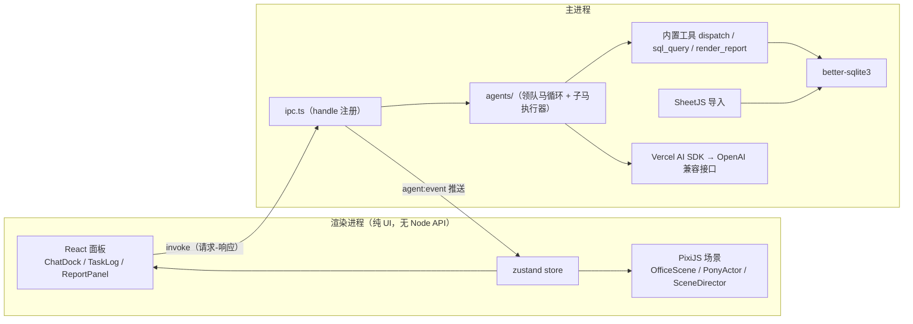

# 小马办公室 M1-M2 接口标准与实施规范

> 本文档是交给开发者（人或 AI）的实施任务书。产品背景见 [../prd.md](../prd.md)。
> **接口的唯一事实源是代码文件 `src/shared/types.ts` 与 `src/shared/ipc.ts`**，本文内嵌的类型定义与其保持一致；如需变更接口，先改这两个文件再改实现。

## 0. 仓库现状（开发前必读）

脚手架与接口层**已经存在**，不要重新初始化项目：

| 已完成 | 位置 | 说明 |
|---|---|---|
| 依赖安装 | `package.json` | electron-vite 工程；vite 已锁 7.x（electron-vite 5 不支持 vite 8，勿升级） |
| 工程配置 | `electron.vite.config.ts`、`tsconfig.*.json` | 别名 `@shared` → `src/shared`，`@` → `src/renderer/src` |
| 接口标准 | `src/shared/types.ts`、`src/shared/ipc.ts` | 本文第 2~4 节的代码化版本 |
| preload 桥 | `src/preload/index.ts`、`index.d.ts` | `window.api` 已按 `WindowApi` 接口暴露 |
| 参考实现 | `src/main/`、`src/renderer/` | 各模块已有一版实现，可续用 / 改写 / 重写，但必须保持接口不变 |
| 演示数据脚本 | `scripts/make-demo-xlsx.mjs` | `npm run make-demo` 生成电信演示 xlsx |
| 环境配置模板 | `.env.example` | 复制为 `.env` 填写模型配置 |

常用命令：`npm run dev`（开发）、`npm run typecheck`（双端类型检查）、`npm run rebuild`（为 Electron ABI 重编译 better-sqlite3，首次运行前必须执行）、`npm run make-demo`。

## 1. 架构与模块职责



硬性边界：

1. 渲染进程 `contextIsolation: true`、`nodeIntegration: false`，只能通过 `window.api` 与主进程通信。
2. **AgentEvent 事件流是渲染进程感知任务进度的唯一通道**；场景动画与任务日志是同一事件流的两个消费视图，禁止另设状态同步通道。
3. LLM 调用、MCP、SQLite、文件操作全部只在主进程发生。

## 2. 共享数据模型（src/shared/types.ts）

```ts
export type PonyId = 'leader' | 'data' | 'report' | 'file' | 'writer' | (string & {})
export type PaletteId = 'linen' | 'camel' | 'ochre' | 'sage' | 'terracotta'

export interface Pony {
  id: PonyId
  name: string          // 如「数据马」
  role: string          // 职能描述，领队马派单依据
  builtin: boolean
  skin: { palette: PaletteId; accessories: string[] }
  skills: string[]      // M2 恒为空，M4 启用
  mcpServers: string[]  // M2 恒为空，M4 启用
}

export interface ChatMessage {
  id: string
  role: 'user' | 'leader'
  content: string
  attachments?: { filename: string; kind: 'xlsx' }[]
  createdAt: number
}

export interface TableSchema {
  table: string                            // data_ 前缀
  columns: { name: string; type: string }[]
  rowCount: number
  sampleRows: Record<string, unknown>[]    // 抽样 5 行，供数据马 prompt
}

export interface ReportMeta {
  id: string
  title: string
  createdAt: number
}
```

预置小马（种子数据，不可删）：

| id | name | palette | accessories | M2 能力 |
|---|---|---|---|---|
| leader | 领队马 | camel | brass-tag | dispatch 工具 |
| data | 数据马 | sage | glasses | sql_query 工具 |
| report | 报表马 | terracotta | beret | render_report 工具 |
| file | 文件马 | linen | bowtie | 无（M4 接 filesystem MCP），领队马不得向其派单 |
| writer | 文书马 | ochre | —— | 纯 LLM，无工具 |

## 3. Agent 事件协议

```ts
export type AgentEvent =
  | { type: 'run_started';       runId: string; userQuery: string }
  | { type: 'leader_thinking';   runId: string }
  | { type: 'leader_say';        runId: string; text: string }      // 流式增量，逐 token
  | { type: 'task_dispatched';   runId: string; taskId: string; from: 'leader'; to: PonyId; brief: string }
  | { type: 'tool_call_started'; runId: string; taskId: string; pony: PonyId; tool: string; argsSummary: string }
  | { type: 'tool_call_finished';runId: string; taskId: string; pony: PonyId; tool: string;
      ok: boolean; resultSummary: string; durationMs: number }
  | { type: 'task_completed';    runId: string; taskId: string; pony: PonyId; summary: string }
  | { type: 'task_failed';       runId: string; taskId: string; pony: PonyId; reason: string; retriesUsed: number }
  | { type: 'report_ready';      runId: string; reportId: string; title: string }
  | { type: 'run_finished';      runId: string; ok: boolean; finalText: string }
```

### 3.1 事件发射规则（主进程实现必须遵守）

1. 每轮任务以 `run_started` 开始、`run_finished` 结束（无论成败，**必须保证 run_finished 一定发出**，渲染进程靠它解锁输入条）。
2. `leader_say` 只携带增量文本；渲染进程自行拼接。`finalText` 为全量文本，用于落库与兜底显示。
3. 每次 `dispatch` 产生唯一 `taskId`，其生命周期内的 `tool_call_*` 事件携带同一 `taskId`，终态为 `task_completed` 或 `task_failed` 二选一。
4. `tool_call_finished.ok=false` 不代表任务失败（模型会重试）；只有重试耗尽才发 `task_failed`。
5. `report_ready` 在 `render_report` 工具执行成功时发出，先于该任务的 `task_completed`。
6. 摘要字段（brief / argsSummary / resultSummary / summary / reason）由主进程截断到 ≤200 字符，渲染进程不做二次截断（气泡内自行截短显示除外）。

### 3.2 典型事件时序（核心演示剧本）

```
run_started → leader_thinking → leader_say*
→ task_dispatched(to=data) → tool_call_started(sql_query) → tool_call_finished(ok)
  [失败时: finished(ok=false) → started → finished … ≤2 次重试]
→ task_completed(data)
→ leader_say* → task_dispatched(to=report)
→ tool_call_started(render_report) → tool_call_finished(ok) → report_ready
→ task_completed(report) → leader_say* → run_finished
```

### 3.3 事件 → 场景动画映射（SceneDirector）

| 事件 | 演出 | 时长建议 |
|---|---|---|
| run_started | 领队马气泡「收到，我来安排！」 | 1.4s |
| leader_thinking | 领队马进入 working 状态（即时，不入队列） | 持续 |
| task_dispatched | 领队马走到目标工位旁 → 气泡显示 brief → 走回自己工位 | 行走 160px/s |
| tool_call_started | 目标小马 working 状态 + 头顶黄铜进度点（即时） | 持续 |
| tool_call_finished(ok=false) | 小马气泡「出错了，再试一次…」（error 色调） | 1.5s |
| task_completed | 小马退出 working → 气泡「搞定！+summary」 | 2s |
| task_failed | 摇头道歉动画 + error 气泡「对不起…没办成：reason」 | 3.2s |
| report_ready | 报表马走到白板 → 贴纸出现（脉冲动画 + 黄铜图钉）→ 气泡提示点击白板 | —— |
| run_finished | 领队马退出 working、归位 | —— |

实现约定：行走/气泡等长动画进入**串行 Promise 队列**保证演出顺序与事件顺序一致；working 状态切换即时生效不入队。

## 4. IPC 契约（src/shared/ipc.ts）

| channel | 方向 | 签名 | 说明 |
|---|---|---|---|
| `chat:send` | invoke | `(text, runId) => void` | 受理即返回；进度走事件流。运行中再次调用应抛错「小马们正在干活」 |
| `chat:history` | invoke | `() => ChatMessage[]` | 启动时恢复对话 |
| `file:uploadXlsx` | invoke | `(path?) => { tables: TableSchema[] } \| null` | 不传 path 由主进程弹文件选择框；取消返回 null |
| `db:listTables` | invoke | `() => TableSchema[]` | |
| `report:get` | invoke | `(reportId) => { html, title } \| null` | |
| `report:list` | invoke | `() => ReportMeta[]` | |
| `report:exportPdf` | invoke | `(reportId) => { savedPath } \| null` | 弹保存框；取消返回 null |
| `pony:list` | invoke | `() => Pony[]` | 固定顺序 leader/data/report/file/writer |
| `agent:event` | 主→渲染推送 | `(e: AgentEvent)` | 第 3 节协议 |

preload 暴露的 `window.api` 形状见 `src/shared/ipc.ts` 中 `WindowApi` 接口（方法名：chatSend / chatHistory / uploadXlsx / listTables / getReport / listReports / exportPdf / listPonies / onAgentEvent，其中 onAgentEvent 返回取消订阅函数）。

## 5. 内置工具规范（主进程，Vercel AI SDK v5 `tool()`）

### 5.1 dispatch（领队马专属）

```ts
dispatch({ to: string, brief: string }) => string  // 子马的结果文本，回喂给领队马
```

- execute 内部运行子马执行器：组装该马 system prompt + 工具集，独立 `generateText` 循环（`stopWhen: stepCountIs(6)`）。
- 子马抛错时 **dispatch 不向上抛**，返回 `任务失败：<原因>。请如实告知用户，不要编造结果。`，让领队马优雅收尾。
- `to` 不存在或为 leader/file 时返回派单失败说明。

### 5.2 sql_query（数据马专属）

```ts
sql_query({ sql: string }) => { rowCount: number; rows: object[] }   // rows 截断至 ≤100 行
                            | { error: string; hint: string }        // 失败回喂，供模型修正重试
```

只读守卫（执行前校验，全部满足才放行）：

1. 去除注释与末尾分号后，必须以 `SELECT` 或 `WITH` 开头；
2. 中间不得再含分号（单语句）；
3. 禁用关键词（词边界匹配）：INSERT / UPDATE / DELETE / DROP / ALTER / CREATE / ATTACH / DETACH / PRAGMA / VACUUM / REINDEX / REPLACE / TRUNCATE。

重试协议：失败计数器挂在**单次任务**上；第 1、2 次失败返回 `{error, hint}` 让模型重试；**第 3 次失败 throw**，由子马执行器捕获 → 发 `task_failed`（retriesUsed=2）。

### 5.3 render_report（报表马专属）

```ts
render_report({ title: string, html: string }) => { reportId: string; message: string }
```

- `html` 为报告**正文片段**（无 html/head/body 标签，无外部资源引用），图表容器 `<div class="chart" id="chartN" style="height:360px">` + `<script>` 内用全局 `echarts` 初始化。
- 主进程包装为完整 HTML 文档：暖色主题 CSS + **内联** `node_modules/echarts/dist/echarts.min.js`（读文件注入 `<script>`，保证离线与 PDF 导出可用），存入 reports 表。
- 成功后依次发 `tool_call_finished(ok)` → `report_ready`。

## 6. SQLite 规范

数据库文件：`app.getPath('userData')/pony-office.db`，开 WAL。

```sql
CREATE TABLE ponies        (id TEXT PRIMARY KEY, json TEXT NOT NULL);
CREATE TABLE chat_messages (id TEXT PRIMARY KEY, json TEXT NOT NULL, created_at INTEGER);
CREATE TABLE reports       (id TEXT PRIMARY KEY, title TEXT, html TEXT, created_at INTEGER);
CREATE TABLE runs          (id TEXT PRIMARY KEY, events_json TEXT, created_at INTEGER);
-- 上传的 xlsx：每个 sheet 一张 data_<sheet名> 表（重复上传 DROP 重建）
```

xlsx 导入规则：

1. 第一行为表头；**列名保留中文原名**（不转拼音），SQL 中一律用双引号包裹标识符；
2. 某列全部非空值均为数字 → 列类型 REAL，否则 TEXT；数字按数值插入；
3. 空行剔除；空表头补 `列N`。

## 7. LLM 与 Prompt 规范

- 接入：`@ai-sdk/openai-compatible` 的 `createOpenAICompatible({ baseURL, apiKey })`；`.env` 三项：`OPENAI_BASE_URL` / `OPENAI_API_KEY` / `MODEL`。
- 领队马：`streamText` + `stopWhen: stepCountIs(8)`，消费 `fullStream` 把 `text-delta` 转成 `leader_say`。
- 各马 system prompt 要点（完整参考实现见 `src/main/agents/prompts.ts`）：
  - **领队马**：注入小马花名册（id/name/role）+ 当前 `TableSchema` 概要；守则：派报表必须在 brief 中附完整分析数据（报表马看不见数据库）；无数据表时提醒上传而非编造；小马失败时如实转告。
  - **数据马**：注入全部 `TableSchema`（schema + 抽样 5 行）；强调 SQLite 方言、中文标识符双引号、只允许单条 SELECT、报错后修正重试。
  - **报表马**：输出结构 = 标题摘要 → KPI 卡片（`.kpi-row`/`.kpi`）→ ≥2 个 ECharts 图表 → 结论列表；暖色系图表配色 `['#B5835A','#8A9B6E','#C96F4A','#D9B98C','#7A6A53']`；数据只能来自 brief。
  - 全部中文输出。

## 8. 视觉规范（渲染进程）

- 设计体系色板：亚麻 `#F7F1E5`、燕麦 `#E9DFC9`、驼 `#C9A77C`、黄铜 `#B08D57`、赤陶 `#C97D5E`、鼠尾草 `#8A9B6E`、墨 `#4A4036`；小马五套调色板与场景环境色见 `src/renderer/src/scene/palettes.ts`。
- 场景：2D 侧视；设计坐标系宽 1680、地面 y=0；6 个工位锚点 x = [220, 450, 680, 910, 1140, 1370]；白板在 x≈1560（eventMode='static'，点击打开最新报告）。背景（墙/地板/窗光）按实际窗口尺寸绘制，物件层等比缩放贴地。
- 小马：纯 Pixi Graphics 程序化矢量（圆润色块），骨骼分层 = 后腿对/前腿对（髋部支点）/身体组（呼吸缩放）/头/眼睑/配件；动画全部程序生成：idle 呼吸（±1.8% 纵向正弦）、随机眨眼（1.8~4.4s 间隔）、行走（腿摆 ±0.5rad + 身体起伏 + 朝向翻转）、working（前蹄敲击 + 头顶三点脉冲）、道歉（摇头 + error 气泡）。
- UI 面板：React + CSS（亚麻纹理用 repeating-linear-gradient、黄铜描边、柔和阴影、衬线标题）；布局 = 左上标题、右侧可折叠任务日志（330px）、底部居中对话坞、报告 modal（sandbox="allow-scripts" 的 iframe srcDoc）。
- 渲染进程入口**不要用 React StrictMode**（dev 双挂载会重复初始化 Pixi Application）。

## 9. 实施顺序与验收标准

### M1 骨架与场景

实施顺序：场景（OfficeScene → PonyActor → 动画）→ React 壳 → mock 事件联调（`src/renderer/src/mock/mockRun.ts` 已提供完整 mock 序列，dev 模式标题栏有「动画演示」按钮）。

- [ ] `npm run dev` 启动，办公室场景渲染正常，缩放窗口布局不破
- [ ] ≥3 只小马有 idle 呼吸 + 眨眼动画，调色板各不相同
- [ ] mock 事件序列驱动：行走 → 气泡 → 干活动画 → 复位
- [ ] 场景常驻 60fps；React 面板与 canvas 无事件穿透问题
- [ ] 渲染进程无 Node API 访问

### M2 真实闭环

实施顺序：xlsx→SQLite 链路 → 领队马循环与 dispatch → 数据马（sql_query + 守卫 + 重试）→ 报表马（render_report + 报告面板 + PDF）→ 真实事件流接管 mock。

- [ ] 上传演示 xlsx，输入「分析各营业厅业务表现并出报告」端到端跑通：派单动画 → 真实 SQL（日志可见语句与行数）→ ≥2 个 ECharts 图表的报告 → 白板可点开
- [ ] 领队马流式输出；任务运行期输入条禁用并有状态提示
- [ ] 任务日志完整：派单 brief、每次 tool call 的参数/结果摘要与耗时
- [ ] 故意提失败问题：重试 ≤2 次后 task_failed + 道歉气泡
- [ ] SQL 守卫拒绝非 SELECT（手工构造 DROP 验证）
- [ ] PDF 导出成功；断网/超时报错明确、应用不崩溃
- [ ] 重启后对话历史、数据表、报告从 SQLite 恢复

## 10. 已知坑位（务必避开）

1. **vite 版本锁定**：electron-vite 5 的 peer 依赖是 vite ≤7，`@vitejs/plugin-react` 须用 5.x，不要升 vite 8。
2. **better-sqlite3 ABI**：首次运行前必须 `npm run rebuild`（@electron/rebuild），否则 Electron 内加载原生模块报 NODE_MODULE_VERSION 不匹配。若 rebuild 在目标机器失败（无 VS Build Tools 且无对应预编译包），降级方案：改用 Node 内置 `node:sqlite`（DatabaseSync，API 形状与 better-sqlite3 接近），只需替换 `src/main/db/index.ts` 的实现。
3. **AI SDK v5 API**：工具定义用 `inputSchema`（zod），多步循环用 `stopWhen: stepCountIs(n)`（不是 v4 的 maxSteps）；`fullStream` 的文本增量 part 为 `{ type: 'text-delta', text }`。
4. **ECharts 必须内联注入**报告 HTML（不要 CDN），否则演示断网时报告空白、PDF 导出无图。
5. **PDF 导出**需在 printToPDF 前等待 ECharts 首帧（约 900ms 延时或监听渲染完成）。
6. **中文标识符**：SQL 中表名列名必须双引号；prompt 中要给出带引号的示例，否则模型常写裸中文标识符报错。
7. **Enter 发送**要排除中文输入法组合态（`e.nativeEvent.isComposing`）。
8. **运行互斥**：同一时间只允许一轮 run；主进程持 running 标志，重复 chat:send 抛错。
